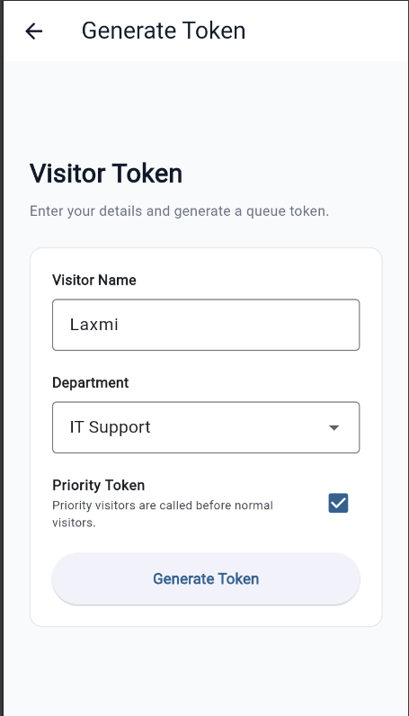
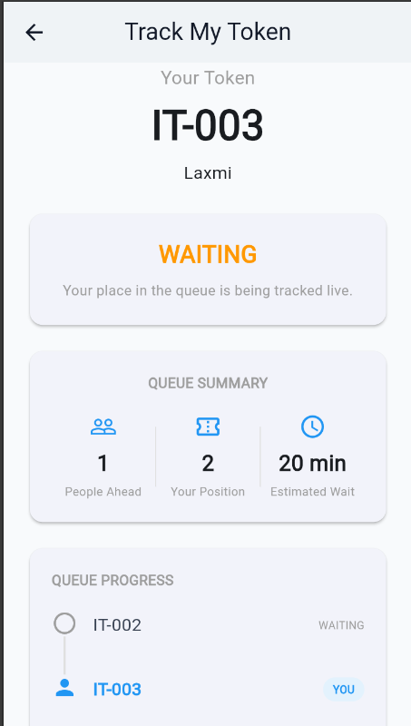
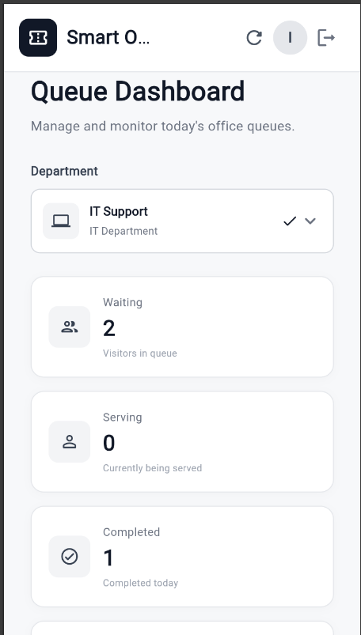
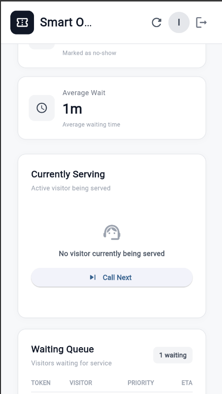
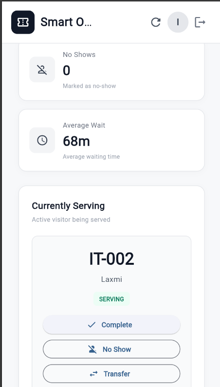
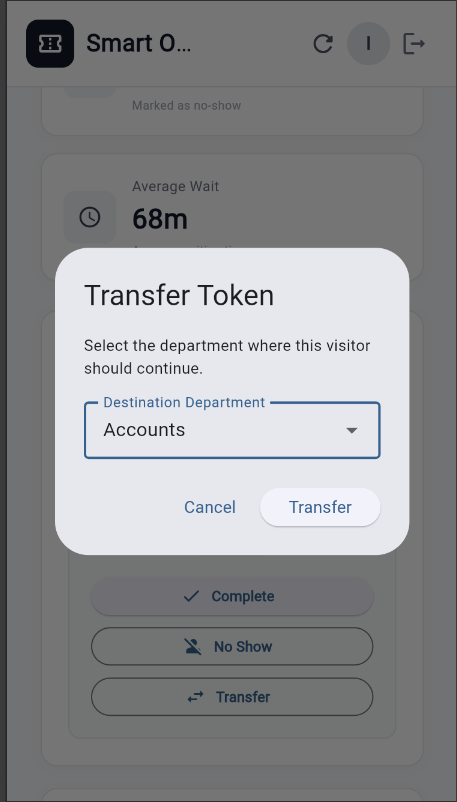
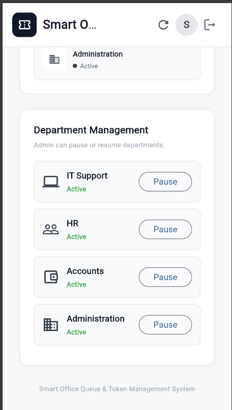
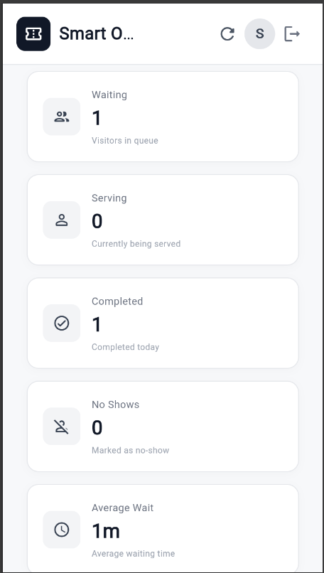
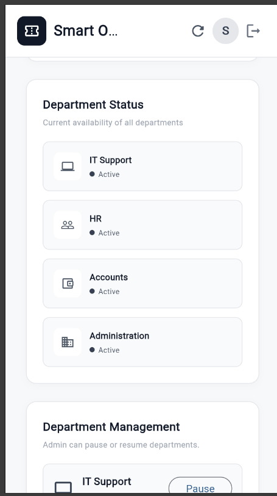

# Smart Office Queue & Token Management System

A full-stack queue and token management system designed for office visitors and staff. The system allows visitors to generate department-specific tokens and enables staff/admin users to manage queues in real time.

## Features

### Visitor Features
- Generate queue tokens without login
- Select department
- Automatic department-specific token numbers
- Priority token support
- View current queue position
- View people ahead in the queue
- View estimated waiting time
- Cancel token
- Track token status
- Automatically updated queue information

### Staff Features
- Staff login
- View department queue
- View currently serving token
- Call Next token
- Complete token
- Mark visitor as No Show
- Transfer token to another department
- View queue statistics

### Admin Features
- Admin login
- View dashboard statistics
- Manage department queues
- Pause/resume departments
- Call Next
- Complete tokens
- Mark No Show
- Transfer tokens
- Monitor waiting, serving and completed tokens

### Queue Management Logic
- Priority tokens are served before normal tokens.
- A priority token does not interrupt a token currently being served.
- First No Show moves the token to the end of the queue.
- Second No Show automatically cancels the token.
- Paused departments cannot generate new tokens.
- Transferring a token creates a new token number for the destination department.
- Queue position and estimated waiting time update when the queue changes.
- Only one token can be actively served in a department at a time.

## Departments

The system currently supports:

| Department     | Code |

| IT Support     | IT   |
| HR             | HR   |
| Accounts       | ACC  |
| Administration | ADM  |

## Technology Stack

### Frontend
- Flutter
- Dart
- Material 3
- HTTP / REST API

### Backend
- Go (Golang)
- REST API
- JWT Authentication
- bcrypt Password Hashing

### Database
- PostgreSQL

### Development Tools
- Visual Studio Code
- Android Studio / Flutter SDK
- WSL Ubuntu
- Git & GitHub

## Screenshots

### Visitor Token Generation

### Queue Status

### Staff Dashboard

### Call Next

### No Show and Complete

### Token Transfer

### Department Pause and Resume

### Admin Dashboard

### Admin Dashboard

## Project Structure

smart-office-queue/
│
├── backend/
│   ├── database/
│   ├── handlers/
│   ├── middleware/
│   ├── models/
│   ├── repository/
│   ├── services/
│   ├── utils/
│   ├── .env
│   ├── go.mod
│   └── main.go
│
├── frontend/
│   └── smart_office_queue/
│       ├── lib/
│       ├── android/
│       ├── ios/
│       ├── web/
│       └── pubspec.yaml
│
├── database/
│   └── schema.sql
│
├── screenshots/
│
│
├── .gitignore
└── README.md

